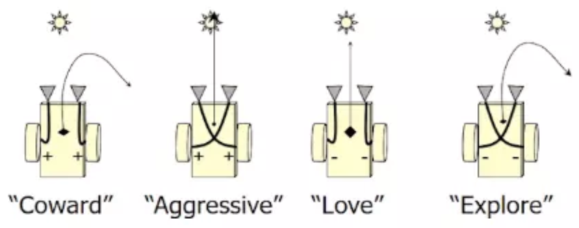

# Braitenberg Vehicles Simulator: Iteration 1 
## Version 3 - Last Updated Monday 3/4 at 9:40pm
### Note - in the discussion below we use the terms Braitenberg Vehicles and Robot interchangably (i.e., they are the same thing: Braitenberg Vehicle = Robot)

>Your software is a reflection of your understanding of the requirements as specified in this document. If you do not understand any portion of the requirements or you think that the requirements are underspecified, it is your responsibility to get clarification from the instructor or a TA. Please read this document carefully and review it often WELL IN ADVANCE of turning in your iteration for assessment.

|*Due Date* | **Item(s) Due** |
|------|-----|
| FRI,  March 1, 11:55pm |Initial UML Class Design for Factory Pattern and Strategy Pattern and their relationship(s) to Robot and Arena:  <strong> Submit _uml_design.pdf_ file in project/docs directory in _devel_ branch </strong>|
| TUE, March 5, 11:55pm | Unit Tests for Factory Pattern: <strong>Submit test files in project/tests directory in _devel_ branch  </strong> |
| FRI,  March 8, 11:55pm | Draft of Design Document, Preliminary Code Submission: all robot behaviors implemented, color functionality implemented, collision avoidance implemented, and 9 simple scenarios running <sup>*</sup>:  <strong>Submit all C++ (.cc and header) files in project/src directory in _devel_ branch </strong> <strong>Submit _design.pdf_ file in project/docs directory in _devel_ branch </strong>  |
| FRI,  March 15, 11:55pm | Documentation and Code Implementation for Iteration 1:  <strong>Submit all deliverables in proper directories in project folder in _master_ branch </strong> |

<sup>*</sup>For your preliminary submission, please have all four robot behaviors implemented; the updated collision behavior implemented; the color functionality implemented, and the first 9  simple scenarios (specified in priority 2 requirements below) operational.

### Project Overview

In this iteration, you will begin understanding the design of an existing simulation and then, update and augment the design, tests, and code to simulate the behavior of Braitenberg Vehicles. Braitenberg Vehicles (which we also refer to as Robots) are the thought experiments of Valentino Braitenberg, who imagined complex behavior emerging from simple design. His vehicles exhibit aggression, fear, exploration, and love through simple sensor-motor connections. You should review the following links to thoroughly  familiarize yourself with Braitenberg Vehicles.

- <a href="https://en.wikipedia.org/wiki/Braitenberg_vehicle" target="_blank">https://en.wikipedia.org/wiki/Braitenberg_vehicle</a>
- <a href="https://en.wikipedia.org/wiki/Valentino_Braitenberg" target="_blank">https://en.wikipedia.org/wiki/Valentino_Braitenberg</a>
- <a href="http://robohub.org/simple-robots-complex-behaviors-a-control-systems-perspective-on-braitenberg-vehicles/" target="_blank"> http://robohub.org/simple-robots-complex-behaviors-a-control-systems-perspective-on-braitenberg-vehicles/</a> (Watch this video for a quick, informative lesson on Braitenberg Vehicles).
- <a href="https://mitpress.mit.edu/books/vehicles" target="_blank">https://mitpress.mit.edu/books/vehicles</a>

The overall goal of the software project for this course is for you to develop a rudimentary robot simulator in which robot behavior is visualized within a graphics window, and to set up, observe, and document the results of experiments involving the entities in the simulator. The robots will be modeled after Braitenberg Vehicles, which use a simple design to realize complex behavior. The environment will have multiple robots, as well as stimuli such as lights and food. Robots will exhibit different behavior when they sense the stimuli in the environment, depending on their sensor-motor connections related to that stimulus. For example, some robots will be attracted to the light and some fear the light.

Iteration 1 is intended to introduce you to the problem domain, software development process, and code base you will be working with - and to get you more familiar with many of the tools and technologies that have been introduced to you to date (Git, Doxygen, UML, the C++ language, the C++ complier, Google style (compliant with cpplint), the build process (make), and design patterns).

Teaching staff will also be working diligently to provide the structure and support for development, testing, and documentation. Automation in unit testing, style compliance, in-house Github testing, and documentation will make this an easier process, however it means that you will have to develop within the constraints of these systems. Often there is a learning curve and a lot of systems trouble-shooting to get it all working, so start early!

<hr>

### Implementation Framework

You are being provided with a significant initial code base for this iteration. The first iteration is focused on enhancing functionality and getting practiced in the software design and development process. It is also a drop into the depths of C++ syntax. If you have any questions about the provided code, please ask. We do not expect you to understand all the constructs in this code. Below is an outline of the required functionality.

The code is organized such that robot behavior in the arena (i.e. the model) is separate from visualization (i.e. the view), which allows for automated unit testing using Google Test. There is also a controller that handles the communication between the model and the view. The Robot class is composed of many other classes that control various aspects of robot behavior and environment interaction. You will need to maintain this class structure to interface with Google Tests.

#### Robot Arena

The robot arena has entities that are specified in a configuration file. The intent is for the robots specified in the configuration file to carry out their behavior in the Arena with the other entities specified in the configuration file (lights and food). For example:
<ol>
<li>Besides the explore behavior, robots can be configured to exhibit love, fear, and or aggression toward food and/or light entities in the Arena </li>
<li> If a robot bumps into another robot or the wall it should reverse (turn around 180 degrees); advance for 20 simulation time steps, and then turn LEFT 45 degrees (from its current heading) to avoid another collision with the object it collided with. </li>
<li>A robot will change color to illustrate the sensor that is driving its behavior (food or light) </li>
</ol>

##### None of the functionality specified in the numbered items above is implemented in the base code. You will design it and implement it in this iteration.

#### Graphics Environment

The graphics environment consists primarily of a single window with robots, lights, and food. All objects (except for the wall) in the environment will be composed of circles, which greatly simplifies collision detection. You are welcome to add graphics enhancements, such as color, text, or decorations provided it does not interfere with required functionality. The basic graphics window framework has been provided. You will need to get familiar with the graphics library and with the provided code to learn how to draw objects of particular shape in the environment.

#### Graphical User Interface (GUI) and User Input (UI)

A basic GUI with user buttons and input via mouse and keyboard has been provided. The user currently has the following controls:

-  UI buttons Play and Reset
--  Press the Play  button to start the simulation.  Pressing the Play button again pauses the simulation.
--  The Reset button reloads the configuration file, so the simulation starts from the initial configuration
- UI Entity Button
--Pressing the Entity button enables a user to select and review and/or set the behaviors associated with an Entity in the Arena.

For example, when the default configuration file (default.json) is used to run the simulation:
<ul>
<li> there is one (mobile) Light entity, one (stationary) food entity, and one Braitenberg vehicle with default behavior toward light (meaning the robot ignores input from its light sensor) and explore behavior toward food. </li>
<li> The Entity button GUI enables the user to select a robot in the Arena and then change the robot's behavior toward food (to love, cower, explore, or default) and/or light (to aggressive, love, cower, or explore) - or to leave the current behavior in place.  </li>
<li>The GUI also enables the user to turn the robot's mobility off. </li>
<li>If the user selects a light via the Entity button, the user can turn the light's mobility on or off as well.</li>
</ul>

<hr>

### Compiling and Running the Simulation

After merging the iteration 1 code into your _devel_ branch, as discussed in lab10, you can compile the simulation with `make` at the top level of the project directory.

Unfortunately, despite valiant efforts by the TA's to keep the instructors from tinkering with the code after they declared a code freeze, your instructors have mistakenly left a few errors in your program.  **You ARE REQUIRED to complete lab10_advanced_git, and follow the process of finding, fixing, reporting, and tracking the errors (issues) using Git and GitHub issues before making ANY changes indicated here to the software that we have provided for you for iteration 1.**

After completing lab 10, you will have successfully created the simulation executable named <strong> arenaviewer </strong>, which can be found in the directory <strong> build/bin </strong> (assuming you are at the top level of your project directory). You can execute it from the top-level directory of your project directory (where you just "made" the simulation executable) by typing:

```
./build/bin/arenaviewer  scenes/default.json
```

Note, we have provided simulation configuration files to help you test your changes to the simulation - they are specified in JavaScript Object Notation (JSON) and can be found in the scenes directory / folder.  You can create you own configuration file as well!  You should review the following resources to familiarize yourself with JSON:

- <a href="https://en.wikipedia.org/wiki/JSON" target="_blank">https://en.wikipedia.org/wiki/JSON</a>
- <a href="https://www.copterlabs.com/json-what-it-is-how-it-works-how-to-use-it/" target="_blank">https://www.copterlabs.com/json-what-it-is-how-it-works-how-to-use-it/</a>
<p>
The JSON files are used to configure:
<ol> <ol>
<li> the size of the Arena, </li>
<li> the number of Food entities in the Arena, </li>
<li> the number of Light entities in the Arena, </li>
<li> and the number of Robot entities in the Arena</li>
</ol></ol>
when the simulation is initialized.
</p>
The initial position and radius of each entity in the Arena (Robots, Lights, and Food) must also be specified.
<ul>
<li>For food, heading (which should be 0.0 degrees) should also be specified </li>
<li> For robots, in addition to position, heading (in degrees) and sensor behavior toward light and food entities must be specified </li>
</ul>

<hr>

### Iteration Requirements - Table of Contents

<ol type="I">
<li> <a href="#reqs">Iteration Requirements</a>
  <ol type="A">
    <li><a href="#reqs_design">Design Requirements</a>
  <li><a href="#reqs_doc">Documentation Requirements</a>
    <ol type="i">
    <li> <a href="#design_doc">Design Document</a>
    <li> <a href="#doxy">Doxygen</a>
    <li> <a href="#style">Style Compliance</a>
    <li> <a href="#self_doc">Self-Documenting Code</a>
    </ol>
  <li><a href="#reqs_dev">Code Development Requirements</a><ol>
  <li> <a href="#issue">Issue Report</a>
  <li> <a href="#git_usage">Git Usage</a></ol>
  <li><a href="#reqs_imp">Implementation Requirements</a>
    <ol type="i">
    <li><a href="#reqs1">Priority Level 1: Design and Testing</a>
    <li><a href="#reqs2">Priority Level 2: Robot Behaviors: Love, Cower, Aggression, Collision; Changing Colors, and Collision Avoidance</a>
    <li><a href="#reqs3">Priority Level 3: Implementing the Factory Pattern</a>
       </ol>
  </ol>
<li> <a href="#deliver">Deliverables and Submission</a>
<li> <a href="#assess">Assessment</a>
 <li> <a href="#resources">Resources</a>
</ol>

<hr>

#### <a name="reqs_design">Design Requirements</a>

One design requirement is the appropriate use of the **__Factory design pattern__** to implement some aspect of the functional requirements. The interaction between Arena and the configuration files (specified in JavaScript Object Notation (JSON)), and the entities that are enclosed by the Arena provide a good opportunity to employ the Factory Pattern. Another design requirement is to create an initial UML design of how you plan to refactor the simulation code to employ the **__Strategy design pattern__**.

One way to implement the Factory Pattern is as a pure abstract class (an interface class) from which the Robot, Light, and Food Factory classes will derive their common interface. The Robot, Light, and Food factory classes will be employed by the Arena to create the various entities (i.e., robots, lights, and food) that will be present and operate in the Arena based on the configuration file. There are other ways as well, and you will consider these other approaches in your design document.

How and where to employ the Strategy desing pattern is up to you - but remember, the Strategy Pattern is an overarching pattern that is deployed in a way that makes your implementation cohesive and loosely coupled.  One way to think about how to incorporate the Strategy pattern is to think about how each Robot will effect (carry out) different behaviors based on the input from different sensors (which, for this iteration, sense light and food). Remember, a robot's behavior in response to sensing light and food can change (so their behaviors in response to each of the sensors is dynamically configurable). 

#### Design Decision

For your first preliminary deliverable submission for this iteration, due Friday March 1st at 11:55pm, you should produce a UML class diagram that specifies your **design** of the Factory and Strategy patterns and their relationships to the Robot and Arena classes (and their methods). Your UML diagram can be a PDF of a UML drawing composed by hand, a drawing using Shapes and text in PowerPoint or Word, or a UML drawing using a tool like Visio.

## Design Document Requirements

In addition to the UML design document, a preliminary version of a design document will be due (in pdf form) on <del>Tuesday, March 5th</del> Friday, March 8 at 11:55pm. This is a _draft_ of the final version. Submit a .pdf named design.pdf in the devel branch.

In the design document, compare and contrast 3 versions of the Factory Pattern applied to the Braitenberg Vehicle simulation, including:
- The instantiation of entities in the provided code.
- The use of an abstract Factory class and derived factories as requested in the requirements.
- The use of a concrete Factory class (only 1) that is responsible for the instantiation of all Entity types.

The point of the document is to share your thought process for making software design decisions. Different aspects that you could discuss include: the trade-offs between simplicity and flexibility, the goal of “open to extension, closed to change,” information hiding and data protection, and keeping classes loosely coupled. For each of the 3 approaches, identify at least 1 advantage and disadvantage.

Write prose in a professional voice. Your audience is other programmers. Use UML and/or code snippets to clarify your ideas. The design document should be a minimum of 1 page of TEXT (not including images or code), and it should not exceed 3 pages including images and/or code snippets. It is anticipated that writing at least one paragraph for each of the 3 approaches should meet the minimum page length.

When you submit the final version of the design document with the full implementation required for Iteration 1, you will revise the documentation and UML to describe what you actually implemented and any changes you have made to the UML. You should be able to extract the UML for the Factory Pattern from the UML diagrams generated by Doxygen and include them in your UML design document along with any changes you have made to the Strategy design pattern that you plan to implement. 

<hr>

#### <a name="reqs_doc">Documentation Requirements</a>

- UML design diagram
- Design Document
- Doxygen generated web pages
- Self-Documenting code that is Google Style compliant

Code documentation comes in many forms for many audiences. For this project, **your audience is other programmers** who need to understand class structure and relationships, interfaces, function parameters, function behavior, code organization, class organization, and code logic. Self-documenting code (i.e. using good organization and naming conventions) is an efficient means of communicating, since you have to write the code anyway. _Good_ comments - not too many, not too few - help guide others through the logic and class interfaces. For the larger picture of code and class structure, use UML diagrams and Doxygen-generated (automatic) web pages.

- ##### <a name="design_doc">Design Document</a>

The _design document_ you write contains prose that describes your approach to key design and implementation decisions. The document requirements for iteration 1 are described above.

- ##### <a name="style">Google Style Guide Compliance</a>

Please comply to the Google C++ Style. Running cpplint on your code should generate 0 errors, except we do allow the use of rand(). Check that your methods are CamelCase and your class variables end in an underscore.

See the information at the URL:   https://google.github.io/styleguide/cppguide.html  for more details.

- ##### <a name="doxy">Doxygen</a>

For this iteration, you need a general description for all classes and methods that you create or update, and completely document the Arena, Robot, and Factory classes (You **do not** have to implement the Strategy design pattern in this iteration, but you do have to include it in your initial and final UML design). It is not necessary to document setters and getters (unless they are used in some exceptional manner), and it is not necessary to document obvious parameters of functions.

 As part of your fresh clone prior to submission, please also compile the Doxygen and look at the generated webpages (and UML).

  > The Doxyfile is in _project/docs_. You can run doxygen in 2 ways: `make docs` or at the project folder level: `doxygen docs/Doxyfile`.

When you view the list of classes from _index.html_, there should be a brief description for ALL classes. Within the Arena, Robot, and Factory classes, there should be complete documentation for the member variables and methods.

<hr>

#### <a name="reqs_dev">Code Development Requirements</a>

We have provided the initial code base, which is capable of simulating robot(s) with no behavior or with explore behaviors toward lights and food, lights only, and food only. The provided code also has a UI menu for configuring entities in the simulation.

One of your first steps for iteration 1 code development will be accomplished when you complete lab10 - which will require you to pull the project folder into your support-code branch, merge it into Master, then create the _devel_ branch. As you develop code, for any **significant** change you need to create a branch off of _devel_, modify code in the new branch, test it, and then once it is working, merge the new branch with _devel_. In this way, the _devel_ branch will always be in a compile-able state, AND if you mess something up while you are trying to modify your code, you don't have to restore your repo to a previous version, you just don't merge that branch.

##### <a name="git_usage">Git Usage</a>

Code should be developed in a branch off of the _devel_ branch as described in the next section. As part of the documentation of software development,
1. Create a Github issue for **significant** feature enhancements, refactoring, or fixes.
2. Use an appropriately named branch to address the issue.
3. When done with that issue, commit your changes with a commit message created in the editor (i.e. don't use the -m flag with your commit and the editor will open) that follows the _git_usage_ document included in the docs project folder.
4. Merge the branch into the _devel_ branch, and
5. Close the issue.

Commit messages for less significant modification can be composed at the command line, but should be consistent in style and be informative with regard to what changes were made where. You can make minor edits on the _devel_ branch, but the version you keep in your development branch should always compile without errors and execute.

DO NOT merge the _devel_ branch with _master_ until the final implementation is ready for submission. We expect to see exactly 2 modifications to the _master_ branch (one for lab10 and one for iteration 1) between lab09 submission and the iteration1 due date of Friday, March 15. If you accidentally merge with master at some other point, let us know but don't try to fix it. We'll look at it and decide if it needs addressing.

##### <a name="issue">Issue Tracking</a>

You will be using Github _issues_ to track bugs, feature enhancements, refactoring, and other needed modifications to the code. Please use the appropriate label when you create an issue and document it in the comments section. For example, if it is a bug:
1. describe the defect,
2. state its location as best you can determine (e.g. file, class, method, etc.),
3. state how to recreate the bug during execution, and
4. provide an analysis of the cause or some suggestions on how to fix it (if known).

It might be that you have extensive notes and documentation on the defect, or it might be relatively brief, for example:
<ul>
<li>
 "Robots and objects occasionally pass through other entities, which is easily seen when entities collide. Fix in Arena::AdjustEntityOverlap(). Suspect its a sign issue related to the quadrant of impact."
</li>
<li>
 Or "Text on robot is not oriented correctly when robot turns. Fix in GraphicsArenaViewer::DrawRobot. Likely a radian-degree conversion problem."
</li>
</ul>

 The documentation should be sufficient for some (imaginary) teammate to tackle this bug without conversing with you. When the issue is resolved and you have merged the change into your _devel_ branch, close the issue on Github.

<hr>

#### <a name="reqs_imp">Implementation Requirements</a>

The iterative method identifies and prioritizes feature enhancements and code refactoring over short intervals called sprints. Below is a prioritized list of feature enhancements, fixes, and refactoring of the code. **Complete all functionality in one priority level before moving on to the next.** In this way, if we run out of time, the low priority items will be dropped from the requirements.

<p align="center">

</p>

  Image from <a href="https://levelten.org/robotic-system-architecture-robotic-controls/" target="_blank">https://levelten.org/robotic-system-architecture-robotic-controls/</a>_


##### <a name="reqs1">Priority Level 1 : Design and Testing </a>

- A UML diagram augmented with the additions you will make to the design (that is, the UML Class Diagram) of the Arena and Braitenberg Vehicle class diagram (your will create and incorporate the UML class design for the Factory Design Pattern and Strategy Design Pattern and specify the relationship of those classes to the Arena and Braitenberg Vehicle classes) <strong> Due March 1st at 11:55pm </strong>
- A draft of the design document as discussed under that section. Due <del>March 5th</del> Friday, March 8 at 11:55pm.
- The functional interface to the Unit Tests for the Classes and Methods you plan to add for the Factory Design Pattern.  <strong>Due March 5th at 11:55pm</strong>

  - Note that unit tests require a functional interface (i.e. class and method declarations) but not implementation. For example, you can define a class named MyClass in your myclass.h file, and in the myclass.cc file, all methods are empty, such as the following method to get an integer value from the class MyClass:  `int MyClass::get_integer_value() {}`.  </li>

  - For each class, create a file (e.g. factory_unittest.cc) and put it in the project/tests directory (in the _devel_ branch). The Makefile we have provided will compile it for you.  Run the tests by typing <strong>./build/bin/unittest</strong>.  </li>

  - Finally, a sample test has been provided for you in the project/test directory.

- Use Google Test and test fixtures to create your unit tests. See: https://github.com/google/googletest for more details, or revisit the lab we did on Google test.


<hr>

##### <a name="reqs2">Priority Level 2 : Implement the Robot Behaviors for Aggression, Love, and Cower; Update (Refactor) the Robot's collision behavior, implement the functionality to set the color of a robot based on the active sensor, and run the 9 basic scenarios:**Due March 8th at 11:55pm**</a>

Note, that the code we have provided for you contains the behavior for the explore behavior. You should read the literature on Braitenberg Vehicles (Robots) provided above and then design and implement the Aggression, Love, and Cower behaviors.

You should also review the code that implements the behavior that a robot displays in response to a collision with an Arena boundary or another robot. In the version we have provided you, when a collision occurs, the robot(s) involved in the collision adjust their heading 180 degrees and resume movement according to their behaviors toward light and food.    You should refactor - that is update  ( design, implement, and test ) the current behavior so that robot(s) involved in a collision adjust their heading 180 degrees, move a short distance (specifically 20 time steps) and then adjust their heading 45 degrees (that is, they turn left 45 degrees from the angle at which they were headed when they collided -- if you want it to match the video +45, but -45 is okay too -- it depends on your perspective).  he refactored collision behavior will ensure that the robots do not become trapped in a corner of the Arena.

Finally, robot behavior (i.e. wheel velocities) is driven by the light and food sensor readings. The drive signal for each wheel from the different types of sensors can be combined in a variety of ways. In this implementation, the drive signals are added together, provided they each contribute. But sometimes, because the particular sensor is not active or because there are no detected stimuli, only one of the sensor signals is driving the wheel speed. To help understand the robot behavior, <del>dynamically set the color of the robot based on which sensor signals are impacting behavior</del> set the color based on how the robot is configured, regardless of the presence or absence of a stimuli (this will match the video). Use the following colors under the following conditions:
1.  Lights should be white
2.  Food should be green
3.  Robot Color should change depending on which sensor(s) are driving the robot. Specifically:
- - If the robot is not using any sensors, the robot should be Maroon in color (122,0,25).
--  If the robot is using both sensors, the robot should be Maroon in color (122,0,25).
- - If the robot is using ONLY the light sensor, the robot should be Gold in color (255,204,51).
- - If the robot is using ONLY the food sensor, the robot should be Blue in color (0,0,255).


We have provided the following configuration files in the directory/folder named  scenes to help you test your behaviors and color functionality:
- default.json
- 2_lights_4_bots.json

Moreover, videos of the following 9 scenarios will be provided to help you test your project for iteration 1.   The videos will depict the following scenarios run with the simulation using the configuration file **default.json** from the scenes directory/folder:

<ol>
<li> Robot Explore - Robot does not sense food (default) or light (default)</li>
<li> Robot aggressive toward food, default toward light </li>
<li> Robot explore toward food, default toward light </li>
<li> Robot love toward food, default toward light </li>
<li> Robot coward toward food, default toward light </li>
<li> Robot aggressive toward light, default toward food </li>
<li> Robot explore toward light, default toward food </li>
<li> Robot love toward light, default toward food  </li>
<li> Robot coward toward light, default toward food </li>
</ol>

When you have implemented the aggressive, love, and coward behaviors, refactored the collision behavior, and implemented the color functionality, your simulation should behave **similarly** to the videos of the scenarios provided above - when your simulation runs with the **default.json** file and sets the robot behaviors according to the behavior specified in the correspondingly numbered video  (for at least the first 5 to 10 seconds).   NOTE - **similar**  does not mean the SAME.

`You do not have to implement the Strategy Pattern in this iteration, but you will in the next.`

<hr>

##### <a name="reqs3">Priority Level 3 : Implement the Factory Pattern and re-test 9 basic scenarios:**Due March 15th at 11:55pm**</a>

As specified in your UML class design document, implement the Factory Design Pattern. Note, you might have to update your design and/or Unit tests to get your implementation of the Factory Design Pattern working correctly. Once your implementation passes your unit tests, re-run the 9 scenarios specified in the Priority Level 2 requirements to ensure the behavior is similar to the behavior you observed with the Priority Level 2 requirements.

<hr>

## <a name="deliver">Deliverables and Submission Process</a>

Everything will be submitted via Github in the master branch of the project directory in your class repo. We will pull your repository at the specified due dates and grade according to the contents at that time. You should be developing in your_ devel_ branch, but at the time of final submission, merge _devel_ with master.

**Late assignments will not be accepted**, but you will receive partial credit for partial completion of the requirements.

Your software will be assessed through automatic testing and by the TAs. The process for testing will be to start by typing  `make clean` then `make`. We **highly encourage** you to make a new clone of your repo on a **cselabs machine** and also `make clean` and `make` to confirm all is working well before submitting your iteration 1 code.

<hr>

## <a name="assess">Assessment</a>

This is the breakdown for point distribution:

25% : Iteration \#1
- 10% : UML Class Design Initial Submission **March 1st** and Design Document Draft Submission **March 8th**
- 10% : Unit Test Submission **March 5th**
- 05% : Preliminary Code Submission **March 8th**
- 40% : Final Documentation - UML, Design Document, Doxygen **March 15th**
- 35% : Final Code and Unit Tests **March 15th**

<hr>

## <a name="resources">Resources</a>

Graphics Libraries :
- https://github.com/wjakob/nanogui
- https://nanogui.readthedocs.io/en/latest/
- https://github.com/memononen/NanoVG
- https://www.opengl.org/

Local System and Compilation:
- Repo: https://github.umn.edu/umn-csci-3081-S19/csci3081-shared-upstream
- Linking library: `/project/bin/obj/
- Compilation: https://gcc.gnu.org/
- Linux quick reference: http://www-users.cs.umn.edu/~larson/repo-website-resources/website/examples/csresources/linux.html
- Makefile Resources: http://www-users.cs.umn.edu/~larson/repo-website-resources/website/examples/csresources/cpp.html

Testing:
- https://github.com/google/googletest
- Unit Testing: https://martinfowler.com/bliki/UnitTest.html

Style:
- https://google.github.io/styleguide/cppguide.html
- https://github.com/google/styleguide/tree/gh-pages/cpplint
- https://www.python.org/downloads/

Documentation:
- http://www.stack.nl/~dimitri/doxygen/
- https://github.com/adam-p/markdown-here/wiki/Markdown-Cheatsheet

IDEs:
- Xemacs: https://www.xemacs.org/
- vi: http://www.lagmonster.org/docs/vi.html
- Atom: https://atom.io/
- Sublime: https://www.sublimetext.com/
- Eclipse: https://eclipse.org/

<hr>
